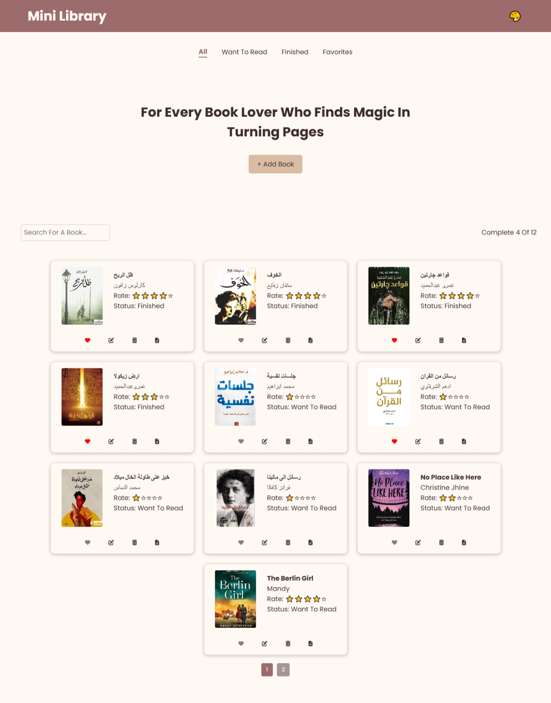

# 📚 مكتبتي الصغيرة | My Little Library

مشروع بسيط عبارة عن مكتبة إلكترونية مصغّرة باستخدام HTML, CSS, و JavaScript.  
يتيح لك عرض الكتب، تتبع حالة القراءة، إضافة ملاحظات، التحكم بالثيم (فاتح / داكن)، بالإضافة إلى فلترة الكتب حسب الفئة.

---

## 💡 فكرة المشروع

"مكتبتي الصغيرة" تساعد المستخدمين على:
- عرض مجموعة من الكتب بواجهة جميلة.
- تتبع حالة قراءة كل كتاب (مقروء - غير مقروء - جاري القراءة).
- إضافة أو تعديل ملاحظات على كل كتاب.
- التحكم في الثيم حسب الرغبة.
- فلترة الكتب حسب الفئات (الكل - المفضلة - المقروءة - ...).

---

## 🚀 المميزات

- ✅ واجهة ديناميكية باستخدام JavaScript.
- ✅ نافذة منبثقة لعرض تفاصيل كل كتاب.
- ✅ إمكانية تعديل الملاحظات.
- ✅ دعم تعدد الثيمات (ثيم كلاسيكي، فاتح، داكن...).
- ✅ حفظ الثيم في Local Storage.
- ✅ عداد للكتب الكاملة والإجمالية.
- ✅ واجهة متجاوبة (Responsive Design).

---

## 🖼️ صورة من المشروع

---

## 🧑‍💻 التقنيات المستخدمة

- HTML5
- CSS3
- JavaScript (Vanilla JS)
- LocalStorage

---

## 🔧 طريقة الاستخدام

1. افتحي `index.html` في المتصفح.
2. تصفحي الكتب المعروضة.
3. اضغطي على أي كتاب لعرض تفاصيله.
4. أضيفي ملاحظاتك، أو غيّري الثيم.
5. راقبي حالة التقدّم من خلال العداد.

---

## 🌐 نسخة مباشرة (GitHub Pages)

https://latifaalnaaimi.github.io/Mini-Library/

---

## 📄 الترخيص

هذا المشروع مفتوح المصدر ومتاح للاستخدام لأغراض تعليمية.

---

# My Little Library 📚

A simple and interactive digital bookshelf built using HTML, CSS, and JavaScript.

---

## 💡 Project Idea

"My Little Library" allows users to:
- Display a dynamic book list.
- Track reading status (Read - Unread - In Progress).
- Add/edit personal notes for each book.
- Filter books by categories.
- Switch between different themes.

---

## 🚀 Features

- ✅ Dynamic book display
- ✅ Book detail popup modal
- ✅ Notes and theme control
- ✅ Filter by status or favorites
- ✅ Dark/light/classic themes
- ✅ Book counter (read/total)
- ✅ Fully responsive layout

---

## 🛠️ Technologies Used

- HTML5
- CSS3
- Vanilla JavaScript
- LocalStorage

---

## 🔧 How to Use

1. Open `index.html` in your browser.
2. Browse through your library.
3. Click any book card to see details.
4. Add notes or change reading status.
5. Use the theme switcher to adjust appearance.

---

## 📸 Screenshot

---

## 🔗 Live Demo

(https://latifaalnaaimi.github.io/Mini-Library/)

---

## 📄 License

This project is open-source and intended for educational use.
